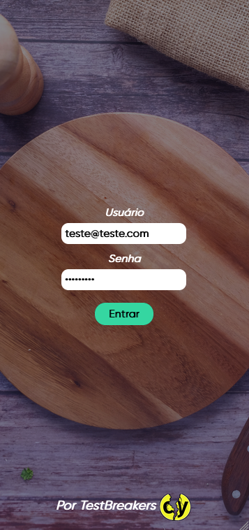
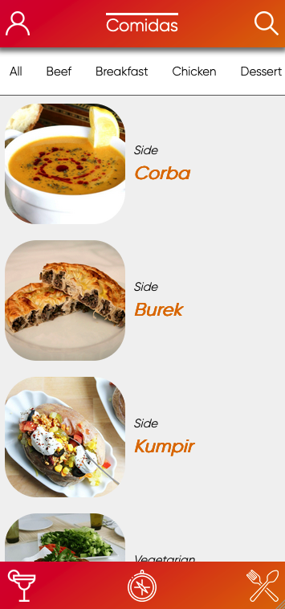
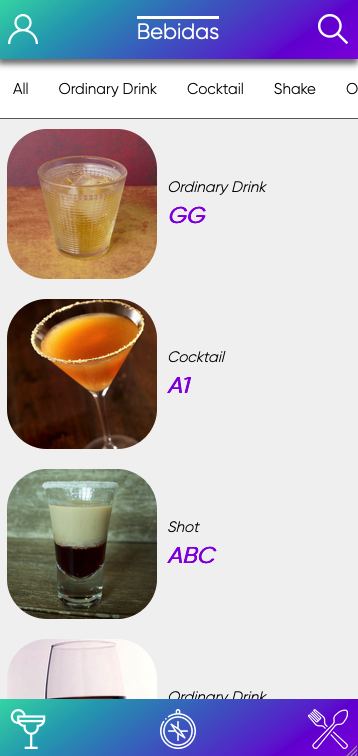
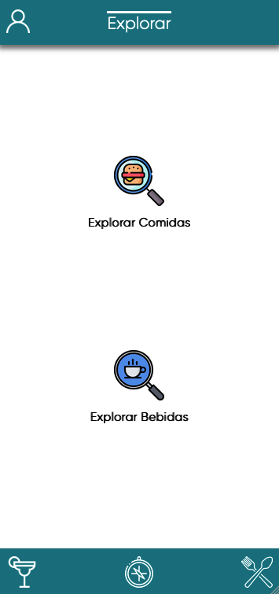
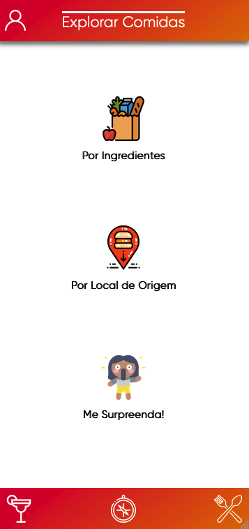
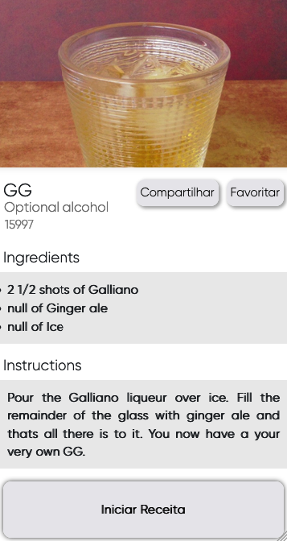

### Sobre o Projeto
Quarto projeto em grupo da Trybe, onde, com o auxilio de Metodologias Ágeis, utilizamos nossos conhecimentos sobre React, Hooks e Context API para criar um aplicativo de receitas. 

---

#### Habilidades colocadas em prática:
  - Utilizar _React Hooks e Context API_ para gerenciar estado
  - Utilizar o _React Hook useState_
  - Utilizar o _React Hook useContext_
  - Utilizar o _React Hook useEffect_
  - Criar Hooks customizados

---
#### Preview
  
  

---
#### Para roda-lo localmente:
Clone o repositório e depois rode os seguintes comandos:

1. `npm install`

2. `npm start`